<h1 align="center">
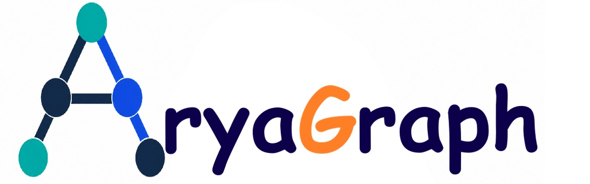
</h1><br>

<p align="center">
  <a href="https://github.com/ruzbahani/AryaGraph/actions/workflows/tests.yml"></a>
  
  
  
</p>

AryaGraph is a Python package for graph and DAG visualization, analysis and simulation. It combines publication-quality drawings, interactive views, rigorous algorithms and dynamic simulations in one coherent library.

- **Website:** https://ruzbahani.com/aryagraph
- **Source code:** https://github.com/ruzbahani/AryaGraph
- **Author:** Ali Mohammadi Ruzbahani
- **Changelog:** [CHANGELOG.md](CHANGELOG.md)
- **Contributing:** [CONTRIBUTING.md](CONTRIBUTING.md)
- **Citing:** [CITATION.cff](CITATION.cff)
- **License:** [MIT](LICENSE)

It provides:

- a graph model with `Graph`, `DiGraph` and a cycle-safe `DAG`;
- layout engines for layered, tree, radial, stress and force-directed drawings;
- a renderer for static SVG, PNG and PDF, plus a dependency-free interactive HTML view;
- 130+ graph algorithms, tested against networkx wherever it offers an equivalent;
- simulation engines for epidemics, cascades, opinion dynamics and project schedules, with animated playback;
- one-call analytical reports and interactive dashboards.

The only runtime dependency is numpy. Layouts are reproducible for the same graph, parameters and random seed; randomized layouts default to `seed=0`. The test suite has 2,446 tests and runs on Python 3.10 to 3.13.

<p align="center">
  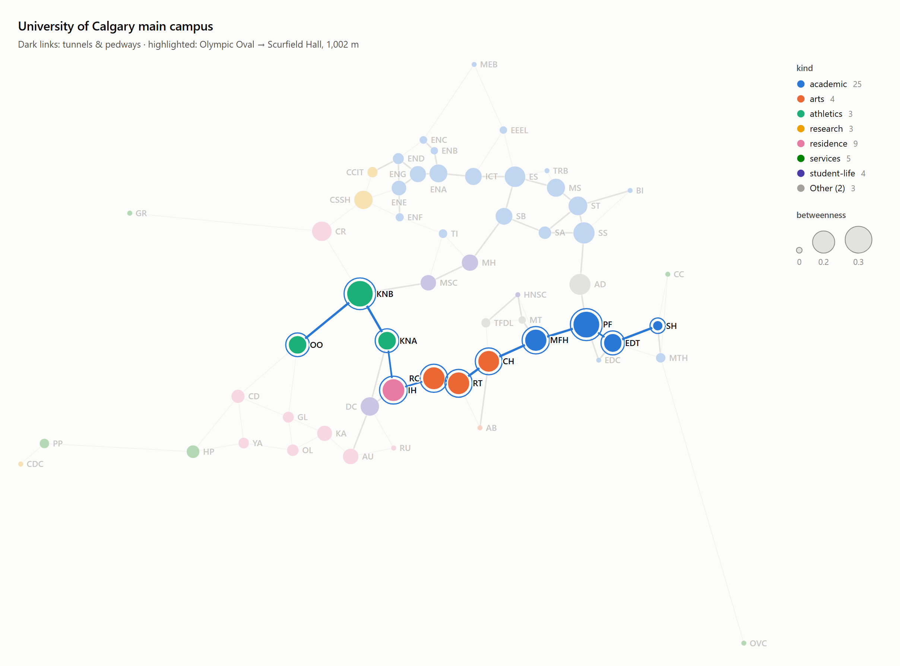
  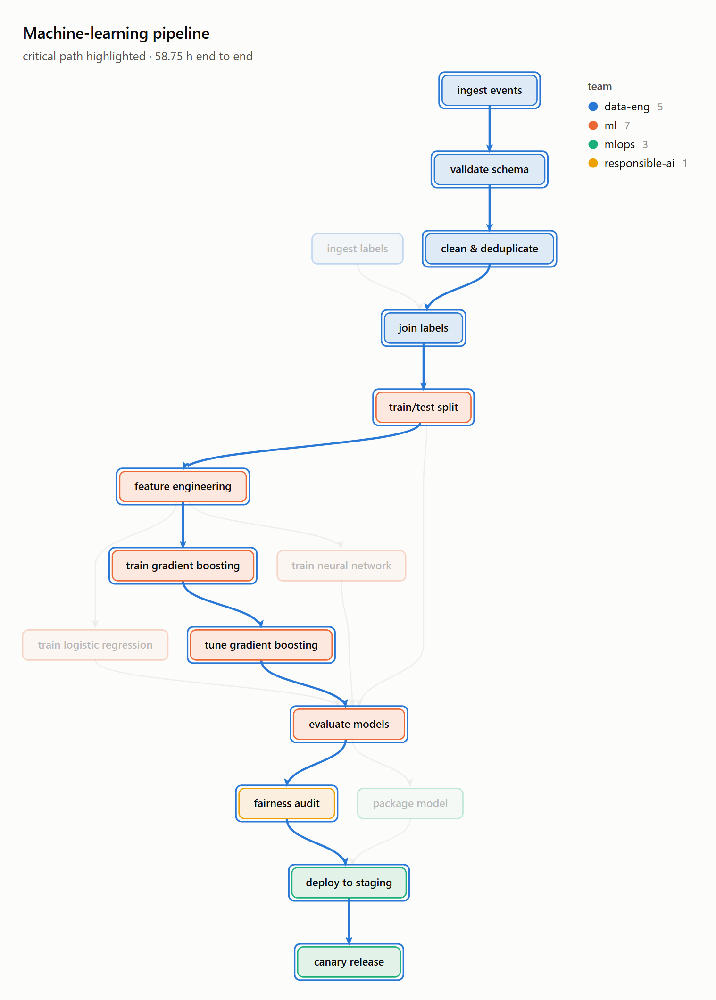
</p>
<p align="center">
  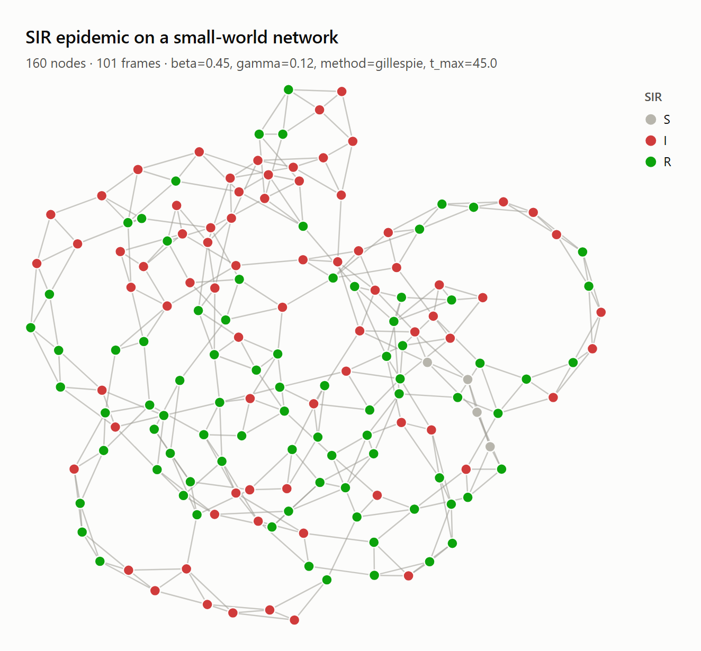
  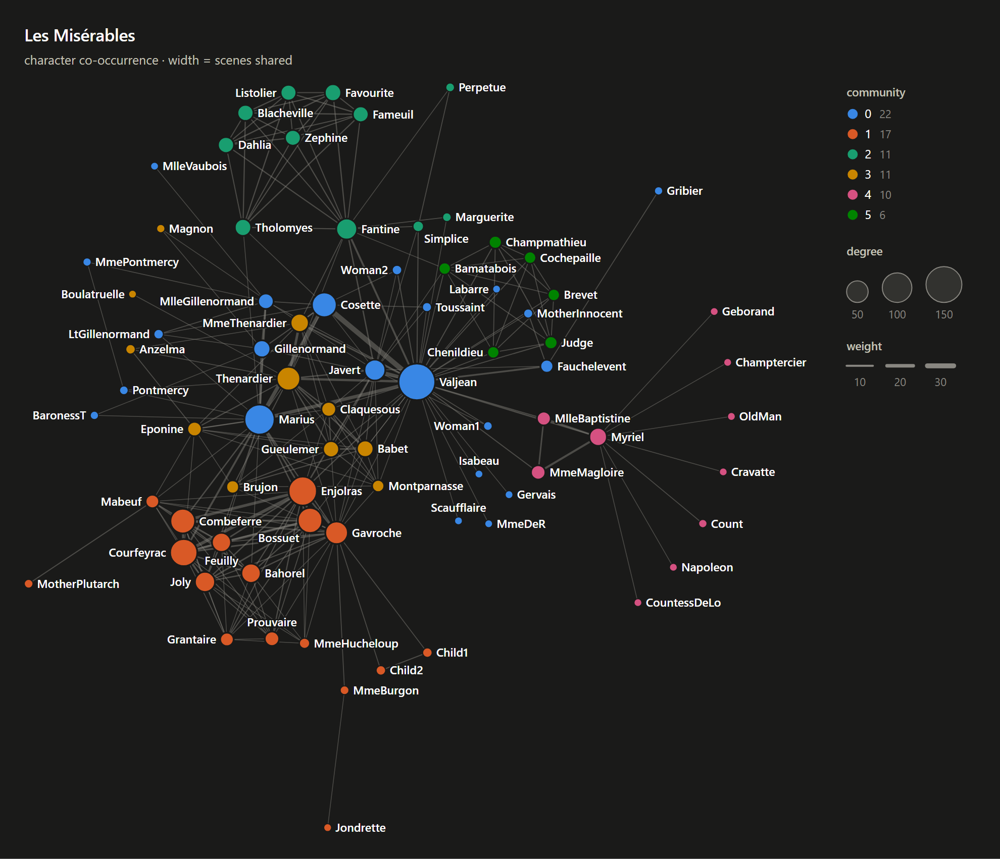
</p>

## Contents

- [Installation](#installation)
- [Quick start](#quick-start)
- [Features](#features)
  1. [Graph model](#1--graph-model)
  2. [Visualization](#2--visualization)
  3. [Interactive HTML](#3--interactive-html)
  4. [Layout engines](#4--layout-engines)
  5. [Algorithms](#5--algorithms)
  6. [Analysis reports](#6--analysis-reports)
  7. [Simulation](#7--simulation)
  8. [DAG execution & project planning](#8--dag-execution--project-planning)
  9. [Charts](#9--charts)
  10. [Datasets & generators](#10--datasets--generators)
  11. [File formats & interoperability](#11--file-formats--interoperability)
  12. [Command line](#12--command-line)
  13. [Languages](#13--languages)
- [Design principles](#design-principles)

---

## Installation

Get the source and install it with pip:

```bash
git clone https://github.com/ruzbahani/AryaGraph.git
cd AryaGraph
pip install .                  # core (numpy only)
```

Optional extras:

```bash
pip install ".[interop]"       # networkx / pandas / SciPy converters
pip install ".[png]"           # cairosvg for PNG/PDF export without a browser
pip install -e ".[test]"       # development install; then run: python -m pytest
```

Requirements: Python 3.10 or newer. PNG/PDF export uses `cairosvg` when installed, otherwise any Chrome, Edge or Chromium found on the system.

## Quick start

```python
import aryagraph as ag

campus = ag.gen.ucalgary_campus()          # 56 University of Calgary buildings and their connections
route = ag.alg.shortest_path(campus, "OO", "SH", weight="length")

fig = ag.draw(
    campus,
    layout={n: d["pos"] for n, d in campus.nodes.data()},   # real campus geometry
    node_color="kind",
    highlight_path=route,
    title="University of Calgary main campus",
    subtitle="Shortest walk from the Olympic Oval to Scurfield Hall",
)
fig.save("campus.html")                    # interactive; also .svg, .png, .pdf

print(ag.analyze(campus))                  # analytical summary
```

---

## Features

### 1 · Graph model

| | |
|---|---|
| `Graph`, `DiGraph` | Simple graphs with arbitrary hashable nodes, attribute dicts on nodes, edges and the graph itself, self-loops, O(1) size queries. |
| `DAG` | A directed graph that stays acyclic: an edge that would close a cycle raises `CycleError` naming the cycle, and bulk inserts are validated in linear time and rolled back atomically. Provides `topological_order()`, `sources()`, `sinks()`, `levels()`, `generations()`, `ancestors()`, `descendants()`, `critical_path()`, `transitive_reduction()`. |
| Views | `g.nodes`, `g.edges`, `g.adj`, `g.succ`, `g.pred` are live, read-only views; `g.nodes[n]` and `g.edges[u, v]` are the attribute dicts. |
| Results | Per-node metrics are `NodeMap`s (dicts with `top(k)`, `rank()`, `describe()`, `normalized()`, `to_array()`, `to_pandas()`); per-edge metrics are `EdgeMap`s. |
| Derived graphs | `subgraph`, `edge_subgraph`, `reverse`, `to_directed`, `to_undirected`, `relabel`, `compose`, `copy`. |
| Errors | A typed hierarchy under `AryaGraphError`: `NodeNotFound`, `EdgeNotFound`, `CycleError` (carries the cycle), `NegativeCycleError`, `NegativeWeightError`, `NotConnected`, `NoPath`, `GraphTypeError`, `ConvergenceError`, `UnboundedFlowError`. |
| Ordering and seeds | Insertion order is preserved everywhere; every random process takes a `seed`. |

```python
dag = ag.DAG([("extract", "clean"), ("clean", "train"), ("clean", "report")])
dag.topological_order()          # ['extract', 'clean', 'train', 'report']
dag.add_edge("report", "extract")
# CycleError: edge 'report' → 'extract' would close the cycle 'report' → 'extract' → 'clean' → 'report'
```

### 2 · Visualization

`ag.draw(g, …)` returns a `Figure` that renders inline in Jupyter and saves to `.svg`, `.html`, `.png` or `.pdf`.

**Data-driven encodings.** Each visual channel accepts one of:
- a constant;
- an attribute name;
- a `{node: value}` mapping, such as any algorithm result;
- a callable;
- a sequence;
- an `ag.by(...)` spec for full control.

Channels are `node_color`, `node_size`, `node_shape`, `node_opacity`, `labels`, `edge_color`, `edge_width`, `edge_label` and `tooltip`.

- **Scales chosen from the data.**
  - Categories use a fixed-order palette validated for color-vision deficiency. With more than eight categories, the seven most frequent keep their colors and the rest fold into "Other".
  - Numbers use perceptual (OKLab) sequential or diverging color scales.
  - Sizes map to *area*, not diameter.
- **Automatic legends** for data-driven color, size, width and shape encodings: categorical swatches, colorbars, size and width keys.
- **Edge clipping.** Edges are clipped to each node's actual outline:
  - circle, ellipse, box, rounded box, pill;
  - diamond, triangle, hexagon, octagon, cylinder.

  Arrowheads scale with the stroke, the line tucks under the head, and self-loops sit in the widest free angle around the node.
- **Label placement.** The label placer avoids overlaps and hides labels that cannot fit; hidden labels stay available in tooltips and the table view. Prominent nodes are placed first. In hierarchies, labels sit inside boxes sized to their text.
- **Edge styles.** `straight`, `curved` (reciprocal arcs bend apart automatically), `flow` (smooth S-curves along a hierarchy, with ports spread across node sides), `orthogonal` (rounded right-angle routing) and `spline`.
- **Emphasis.** `highlight=` / `highlight_path=` bring nodes, edges or a path forward and dim the rest.
- **Themes.** `light`, `dark`, `paper` and `blueprint`, or your own `Theme`; dark mode uses its own tuned color steps.
- **Accessibility.** SVGs carry `<title>` and `<desc>`, text is drawn in ink colors rather than data colors, and the HTML view adds a table of every node and its values.

### 3 · Interactive HTML

Saving to `.html`, or displaying in Jupyter, produces a self-contained page that needs no network or CDN. It provides:
- pan & zoom (wheel, pinch, keyboard);
- hover to highlight a node's neighborhood, and click to pin it with a details panel;
- drag nodes, with incident edges re-routed live;
- search with keyboard navigation;
- click legend entries to filter categories;
- a sortable table view of all nodes and metrics;
- one-click SVG and PNG download.

Several figures can share one page.

### 4 · Layout engines

| method | description |
|---|---|
| `hierarchical` | Sugiyama framework: <ul><li>cycle removal and **network-simplex** layering (also longest-path, Coffman–Graham, or user ranks)</li><li>crossing reduction by weighted median, transpose and sifting</li><li>**Brandes–Köpf** coordinates refined by network simplex</li><li>routed long edges; orientations `TB`, `BT`, `LR`, `RL`</li></ul> |
| `tree` | Buchheim–Walker tidy tree in linear time, with variable node sizes. |
| `radial` | Radial tidy tree on evenly spaced rings, with angular wedges proportional to subtree size. |
| `stress` | Stress majorization (SMACOF) from a classical or pivot MDS start; a strong default for general-purpose graphs. |
| `forceatlas2` | ForceAtlas2 with adaptive speed, LinLog and hub dissuasion options, and Barnes–Hut for large graphs. |
| `fruchterman_reingold`, `spectral` | Classic force-directed and Laplacian-eigenvector layouts, vectorised. |
| `circular`, `shell`, `grid`, `bipartite`, `arc`, `spiral`, `random` | Geometric layouts; `order="auto"` finds crossing-free orders for trees and cycles. |
| `auto` | Hierarchical for DAGs, stress for general graphs, ForceAtlas2 for very large ones. |

In addition:
- Disconnected graphs are laid out per component and packed.
- When drawn, force-directed and stress layouts of up to 3,000 nodes get pixel-space overlap removal.
- Any `{node: (x, y)}` mapping, for example real coordinates, can serve as a layout.

<p align="center">
  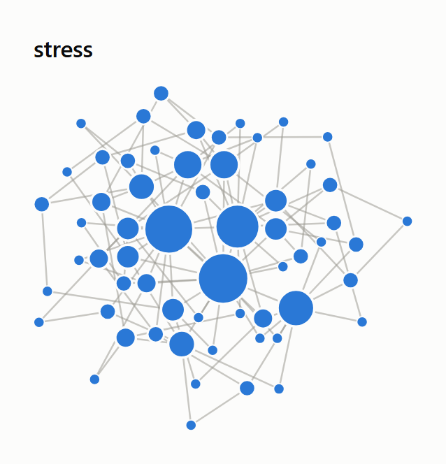
  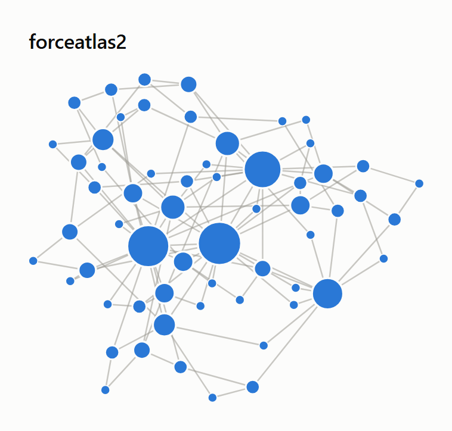
  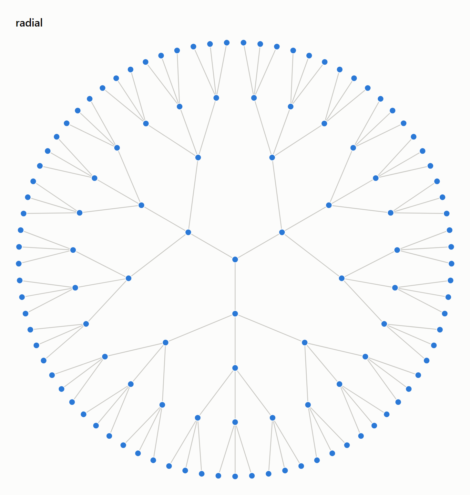
  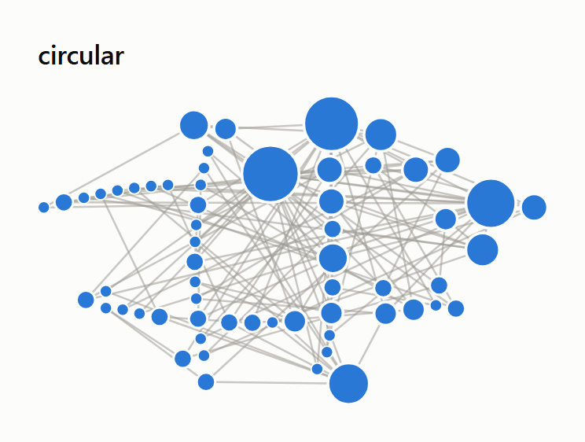
</p>

### 5 · Algorithms

All under `ag.alg`. Functions with a networkx equivalent are tested against it on seeded random graphs; the others are tested on hand-checked cases and invariants.

| area | functions |
|---|---|
| traversal | BFS / DFS orders, edges, layers and trees; ancestors & descendants |
| shortest paths | BFS, Dijkstra, Bellman–Ford (reports the exact negative cycle), A*, Floyd–Warshall, Johnson, all shortest paths, Yen's *k* shortest paths, simple paths |
| connectivity | connected / strongly / weakly connected components (Tarjan), condensation, articulation points, bridges, biconnected components |
| cycles | cycle detection (`find_cycle`), acyclicity test (`is_dag`), Johnson's algorithm for all simple cycles (directed and undirected) |
| DAG | topological sort (lexicographic, or all orders), longest path, **critical path (CPM)** with earliest/latest start and slack, transitive closure & reduction, lowest common ancestors, levels, **width and maximum antichain (Dilworth)** |
| centrality | degree, closeness, harmonic, betweenness (exact or sampled; node & edge), eigenvector, Katz, PageRank (personalization, dangling nodes), HITS |
| structure | density, degree distributions, triangles, clustering (weighted & directed), transitivity, assortativity, reciprocity, eccentricity, diameter, radius, center, periphery, efficiency, k-cores, rich-club coefficient, Wiener index |
| communities | Louvain (with refinement), greedy modularity (CNM), label propagation, fluid communities, Girvan–Newman, modularity, partition quality |
| flow & trees | Dinic max-flow and min-cut; Kruskal / Prim minimum & maximum spanning trees |
| matching & coloring | Hopcroft–Karp, Edmonds' blossom max-weight matching, greedy coloring (seven strategies), bipartiteness |
| link prediction | common neighbors, Jaccard, Adamic–Adar, resource allocation, preferential attachment |
| linear algebra | adjacency, Laplacian (normalized) and incidence matrices; spectra; algebraic connectivity |

### 6 · Analysis reports

`ag.analyze(g)` computes the measures that apply to the graph, with exact all-pairs algorithms up to 3,000 nodes and sampling beyond:
- headline statistics, components, distances and clustering;
- centrality rankings;
- communities and modularity;
- k-cores, bridges and cut nodes;
- for DAGs: depth, width, sources and sinks, redundant edges and the critical path.

Anything that does not apply is skipped with a note. The report can be printed as text, exported with `to_dict()` / `.json`, or saved as an **interactive dashboard** of stat tiles, the explorable graph, distributions, rankings and community tables.

<p align="center">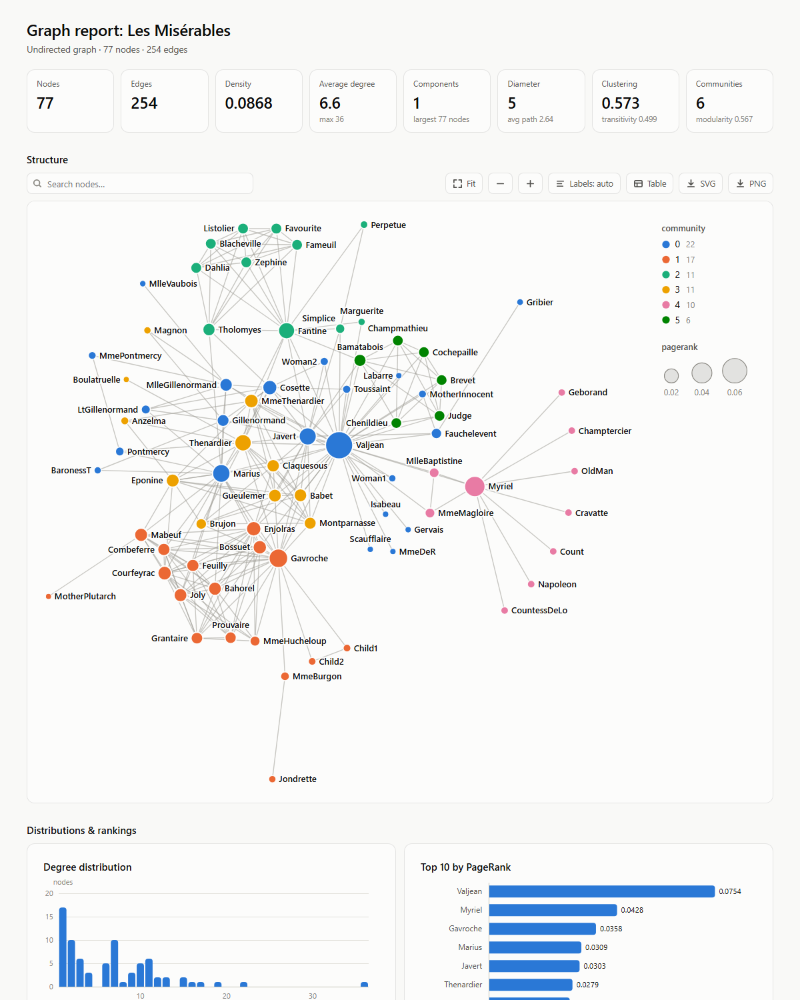</p>

### 7 · Simulation

All under `ag.sim`. Every run returns a `SimulationResult` of per-node states over time, with:
- counts, fractions and peaks, `first_time()`, `history()` and pandas export;
- `.plot()` for the state chart;
- `.animate()` for an interactive player: play/pause, scrubbing, speed control, flashing transmissions and a synced chart.

| family | models |
|---|---|
| epidemics | any compartmental model through `CompartmentalModel`; ready-made `SI`, `SIS`, `SIR`, `SEIR`, `SIRS`, `SEIRD`; discrete-time or exact stochastic (Gillespie) simulation |
| spreading | independent cascade, linear threshold, Monte-Carlo influence estimates, CELF influence maximisation |
| movement | random walks with restarts; stationary distributions by linear solve |
| opinions | voter model, majority rule, DeGroot averaging, bounded confidence (Deffuant) |
| physics | heat diffusion (closed-form solution), Kuramoto oscillator synchronisation |
| ensembles | `run_ensemble`: many seeded runs summarised with mean and 5–95% bands |

```python
g = ag.gen.watts_strogatz(300, 6, 0.08, seed=1)
run = ag.sim.SIR(beta=0.35, gamma=0.1).simulate(g, initial={"I": 3}, t_max=60, method="gillespie", seed=7)
run.peak("I")                  # (time, number infected)
run.animate().save("sir.html")
```

### 8 · DAG execution & project planning

- `simulate_schedule` runs a DAG on a pool of workers. It supports:
  - scheduling policies (critical-path first, FIFO, longest or shortest first, random, or custom);
  - random durations (uniform, triangular, PERT);
  - per-attempt failures with retries;
  - resource limits.

  It reports makespan, utilization, the realized critical path and a Gantt chart.
- `monte_carlo_schedule` gives the distribution of completion time (P50 / P80 / P95) and each task's criticality index.

<p align="center">
  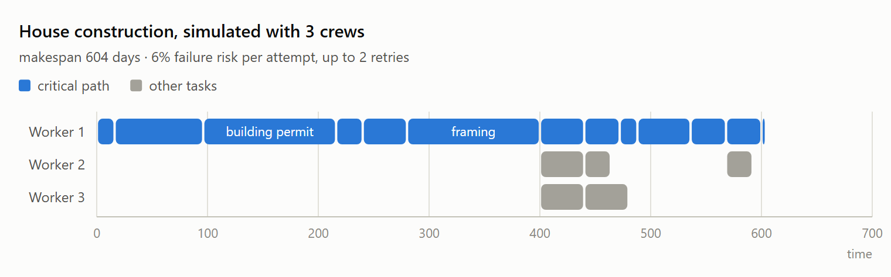
  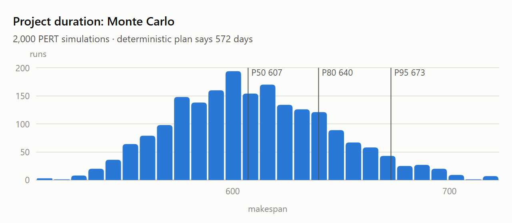
</p>

In the bundled house-construction plan, the deterministic critical path is 572 days. In a seeded run of 2,000 PERT simulations, the median completion is about 607 days and the 95th percentile about 673.

### 9 · Charts

`ag.charts` provides line charts (with uncertainty bands and reference lines), ranked bar charts, histograms and Gantt charts in the same visual language. Each exports to SVG, PNG or PDF, and HTML versions add a crosshair tooltip.

### 10 · Datasets & generators

- **University of Calgary campus.** `ag.gen.ucalgary_campus()` provides 56 main-campus buildings with official codes, names, types and coordinates, joined by the tunnel & pedway network and modelled walking links. Edges carry lengths in metres; `indoor_only=True` gives the indoor network alone. This dataset is used throughout the tests and examples. Building names follow the university's official directory as of 2026; positions are from OpenStreetMap (© OpenStreetMap contributors, available under the [Open Database License](https://opendatacommons.org/licenses/odbl/)), and the dataset can be rebuilt with `tools/build_ucalgary_campus.py`.
- **Classic networks:** Les Misérables co-occurrences, Florentine families, Davis Southern Women.
- **Example DAGs:** a machine-learning pipeline, a software build, a construction project plan, a data-warehouse ETL and course prerequisites. Each carries durations and three-point estimates.
- **Generators:** complete, cycle, path, star, wheel, grid, hypercube, trees, ladders, barbell, lollipop, Petersen, Turán and multipartite graphs. Random models: Erdős–Rényi, Barabási–Albert, Watts–Strogatz, stochastic block, planted partition, random geometric, random regular, configuration model, Holme–Kim, random trees, random and layered DAGs, and random task DAGs.

### 11 · File formats & interoperability

- `ag.read(path)` / `ag.write(g, path)` choose the format from the file extension.
- Supported formats:
  - node-link **JSON** (networkx- and d3-compatible);
  - **CSV/TSV** edge lists and adjacency lists;
  - **GraphML** and **GEXF** (Gephi);
  - **DOT**, with a parser supporting subgraphs, clusters, attribute defaults and edge chains;
  - **Mermaid** flowcharts.
- Converters for networkx, pandas, numpy and SciPy sparse matrices. networkx graphs can also be passed straight to `ag.Graph(...)`.

### 12 · Command line

```bash
aryagraph draw campus.json -o campus.svg --color kind --theme dark
aryagraph draw pipeline.dot -o pipeline.html
aryagraph analyze network.graphml -o report.html
aryagraph info graph.json
aryagraph convert graph.gv graph.graphml
```

### 13 · Languages

Labels, titles, legends and tooltips support **Persian** and other right-to-left scripts (Arabic, Hebrew) as well as CJK text. Text width is estimated per script for layout and label placement, right-to-left text is rendered with the correct direction, and glyph shaping is done by the browser or SVG renderer.

<p align="center">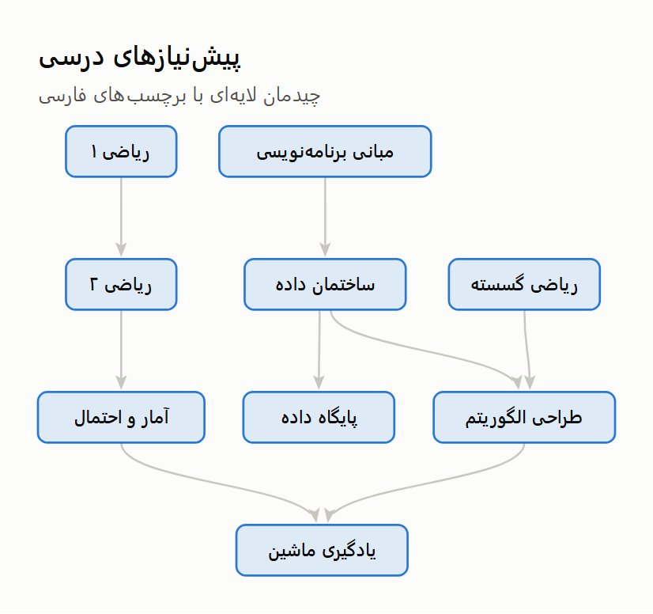</p>

---

## Design principles

- **Computed, not adjusted.** Geometry, legends and label placement are computed from the data and the node shapes.
- **One scene, every output.** `draw()` builds a backend-neutral scene of positioned marks; static and interactive outputs share the same scene geometry.
- **Reproducible.** Layouts are reproducible for the same graph, parameters and random seed; randomized layouts default to `seed=0`.
- **Explicit failures.** Typed errors carry their evidence (the cycle, the negative cycle), and analyses that do not apply are skipped with a note.
- **Screen coordinates.** x to the right and y downward, in every layout.
