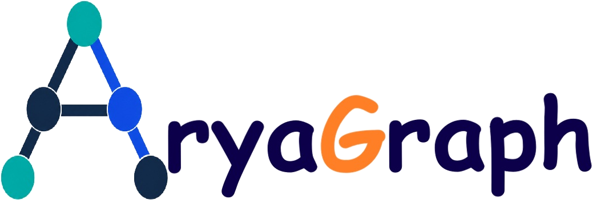

# AryaGraph

<div class="ag-hero">
  <div class="ag-hero-text">
    <div class="ag-hero-logo"></div>
    <p class="ag-headline">Graphs and DAGs, drawn precisely and analyzed in depth.</p>
    <p class="ag-lede">AryaGraph is a Python library for visualizing, analyzing and simulating networks and directed acyclic graphs. Layout engines, a static and interactive renderer, graph algorithms and simulation engines work together in one package whose only runtime dependency is numpy.</p>
    <div class="ag-actions">
      <a class="ag-btn ag-btn-primary" href="getting-started/index.html">Get started</a>
      <a class="ag-btn ag-btn-secondary" href="tutorials/index.html">Tutorials</a>
      <a class="ag-btn ag-btn-secondary" href="https://github.com/ruzbahani/AryaGraph">View on GitHub</a>
    </div>
    <code class="ag-install">pip install git+https://github.com/ruzbahani/AryaGraph.git</code>
  </div>
  <div class="ag-hero-figure">
    <a href="_static/generated/landing/campus.html"></a>
    <p class="ag-caption">The University of Calgary main campus as a graph of buildings, drawn on real positions (© OpenStreetMap contributors, ODbL). Click for the interactive version.</p>
  </div>
</div>

<div class="ag-stats">
  <div class="ag-stat"><b>133</b><span>graph algorithms</span></div>
  <div class="ag-stat"><b>14</b><span>layout engines</span></div>
  <div class="ag-stat"><b>2,457</b><span>tests on Linux, Windows and macOS</span></div>
  <div class="ag-stat"><b>1</b><span>runtime dependency (numpy)</span></div>
</div>

<h2 class="ag-section-title">Everything a graph project needs</h2>
<p class="ag-section-lede">Model the network, lay it out, measure it, simulate what happens on it, and publish the result as a static figure or an interactive page.</p>

::::{grid} 1 2 3 3
:gutter: 3

:::{grid-item-card} Graph model
:link: user-guide/graphs
:link-type: doc

`Graph`, `DiGraph` and a `DAG` that refuses to become cyclic. Insertion order is preserved, so results are reproducible.
:::

:::{grid-item-card} Layout engines
:link: user-guide/layouts
:link-type: doc

Sugiyama hierarchical layout with network-simplex layering, tidy and radial trees, stress majorization, ForceAtlas2 and geometric layouts.
:::

:::{grid-item-card} Rendering
:link: user-guide/drawing
:link-type: doc

Data-driven colors, sizes and shapes with automatic legends, edges clipped to node outlines, overlap-avoiding labels, four themes.
:::

:::{grid-item-card} Algorithms
:link: user-guide/algorithms
:link-type: doc

Shortest paths, connectivity, critical path, centrality, communities, flow, matching and more, tested against networkx where it has an equivalent.
:::

:::{grid-item-card} Simulation
:link: user-guide/simulation
:link-type: doc

Epidemics (discrete and Gillespie), cascades, random walks, opinion dynamics, diffusion and DAG scheduling, with animated playback.
:::

:::{grid-item-card} Analysis reports
:link: user-guide/analysis
:link-type: doc

`ag.analyze(g)` returns a text summary, plain data, or an interactive dashboard of the graph.
:::
::::

<h2 class="ag-section-title">From data to figure in a few lines</h2>
<p class="ag-section-lede">Load the bundled campus graph, find the shortest walk between two buildings, and draw it on the real map.</p>

::::{grid} 1 1 2 2
:gutter: 3

:::{grid-item}
:columns: 12 12 7 7
```python
import aryagraph as ag

campus = ag.gen.ucalgary_campus()
route = ag.alg.shortest_path(
    campus, "OO", "SH", weight="length")
pos = {n: d["pos"] for n, d in campus.nodes.data()}

fig = ag.draw(campus, layout=pos,
              node_color="kind",
              highlight_path=route,
              title="University of Calgary main campus")
fig.save("campus.html")  # or .svg, .png, .pdf
print(" → ".join(route))
```

```text
OO → KNB → KNA → IH → RC → RT → CH → MFH
   → PF → EDT → SH
```
:::

:::{grid-item}
:columns: 12 12 5 5
```{image} _static/generated/landing/campus.png
:alt: Campus graph with the shortest route from the Olympic Oval to Scurfield Hall highlighted
```
<p class="ag-caption">The route is 1,002 m long, measured in straight lines between buildings, and passes through 11 of them. Building positions © OpenStreetMap contributors (ODbL).</p>
:::
::::

<h2 class="ag-section-title">Explore it live</h2>
<p class="ag-section-lede">Every figure can also be saved as a self-contained interactive page: pan and zoom, hover a building to see its neighborhood, drag nodes, search, filter by legend entry, or open the table view.</p>

<iframe class="ag-embed" src="_static/generated/landing/campus.html" height="680" loading="lazy" title="Interactive map of the University of Calgary campus graph"></iframe>
<p class="ag-embed-note">An interactive AryaGraph page, embedded as a static HTML file. Building positions © OpenStreetMap contributors (ODbL). <a href="_static/generated/landing/campus.html">Open full screen</a></p>

<h2 class="ag-section-title">Plan with uncertainty</h2>
<p class="ag-section-lede">DAG tools cover the critical path, simulated execution on a limited number of workers, and Monte Carlo schedules.</p>

::::{grid} 1 1 2 2
:gutter: 3

:::{grid-item}
```{image} _static/generated/landing/montecarlo.png
:alt: Histogram of 2,000 simulated project durations with P50, P80 and P95 reference lines
```
:::

:::{grid-item}
The bundled house-construction plan has a deterministic critical path of **572 working hours**. With PERT uncertainty on every task, 2,000 simulated schedules put the median completion at about **607 hours** and the 95th percentile at about **673 hours**. The case study adds the plan's curing and drying waits, which bring the critical path to 668 hours.

`monte_carlo_schedule` also reports how often each task lands on the critical path, which points at the tasks that deserve the most attention.

[Read the case study](case-studies/construction-schedule.md)
:::
::::

<h2 class="ag-section-title">Gallery</h2>
<p class="ag-section-lede">A few figures made with AryaGraph. The <a href="gallery/index.html">gallery</a> shows the code for each one.</p>

::::{grid} 1 2 2 4
:gutter: 2

:::{grid-item-card}
:img-top: _static/generated/landing/pipeline.png
:link: gallery/index
:link-type: doc

Layered DAG with its critical path
:::

:::{grid-item-card}
:img-top: _static/generated/landing/lesmis_dark.png
:link: gallery/index
:link-type: doc

Communities in the dark theme
:::

:::{grid-item-card}
:img-top: _static/generated/landing/epidemic.png
:link: gallery/index
:link-type: doc

A frame of an SIR epidemic
:::

:::{grid-item-card}
:img-top: _static/generated/landing/persian.png
:link: user-guide/languages
:link-type: doc

Persian labels, right to left
:::
::::

<h2 class="ag-section-title">Case studies</h2>
<p class="ag-section-lede">Complete analyses, from the question to the figures, with the code to reproduce every number.</p>

::::{grid} 1 2 3 3
:gutter: 3

:::{grid-item-card} How connected is the University of Calgary's indoor network?
:link: case-studies/ucalgary-campus
:link-type: doc

How connected are the campus tunnels and pedways, and which single links matter most?
:::

:::{grid-item-card} Scheduling a house build under uncertainty
:link: case-studies/construction-schedule
:link-type: doc

Critical path, crew counts and Monte Carlo risk for a construction plan.
:::

:::{grid-item-card} Critical path and parallelism in an ML pipeline
:link: case-studies/ml-pipeline
:link-type: doc

Parallelism, worker counts, scheduling policies and retries in a machine-learning pipeline.
:::

:::{grid-item-card} Epidemic interventions
:link: case-studies/epidemic-interventions
:link-type: doc

How network structure and targeted immunization change an SIR outbreak.
:::

:::{grid-item-card} Les Misérables: a character network
:link: case-studies/les-miserables
:link-type: doc

Centrality, communities and the characters who connect them.
:::
::::

<h2 class="ag-section-title">Start learning</h2>

::::{grid} 1 2 4 4
:gutter: 3

:::{grid-item-card} Getting started
:link: getting-started/index
:link-type: doc

Install AryaGraph and take the ten-minute tour.
:::

:::{grid-item-card} User guide
:link: user-guide/index
:link-type: doc

Every feature, explained with runnable examples.
:::

:::{grid-item-card} Tutorials
:link: tutorials/index
:link-type: doc

Step-by-step projects, from a first network to publication figures.
:::

:::{grid-item-card} API reference
:link: reference/index
:link-type: doc

Every public function and class, generated from the source.
:::
::::

<div class="ag-closing">
  <p>AryaGraph is created by <b>Ali Mohammadi Ruzbahani</b> and released under the <a href="project/license.html">MIT License</a>. If it helps your work, please <a href="project/citing.html">cite it</a>.</p>
</div>

```{toctree}
:hidden:

getting-started/index
user-guide/index
tutorials/index
case-studies/index
gallery/index
reference/index
project/index
```
